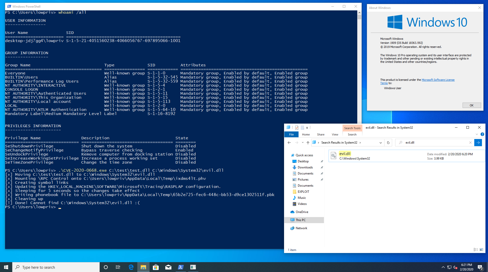

# CVE-2020-0668
Use CVE-2020-0668 to perform an arbitrary privileged file move operation.

Use https://github.com/itm4n/UsoDllLoader (Windows >= 1903) OR https://github.com/xct/diaghub (Windows < 1903) for privilege escalation.

# Demo

Links & Resources
- https://itm4n.github.io/cve-2020-0668-windows-service-tracing-eop/
- https://itm4n.github.io/usodllloader-part1/
- https://itm4n.github.io/usodllloader-part2/
- https://googleprojectzero.blogspot.com/2018/04/windows-exploitation-tricks-exploiting.html
