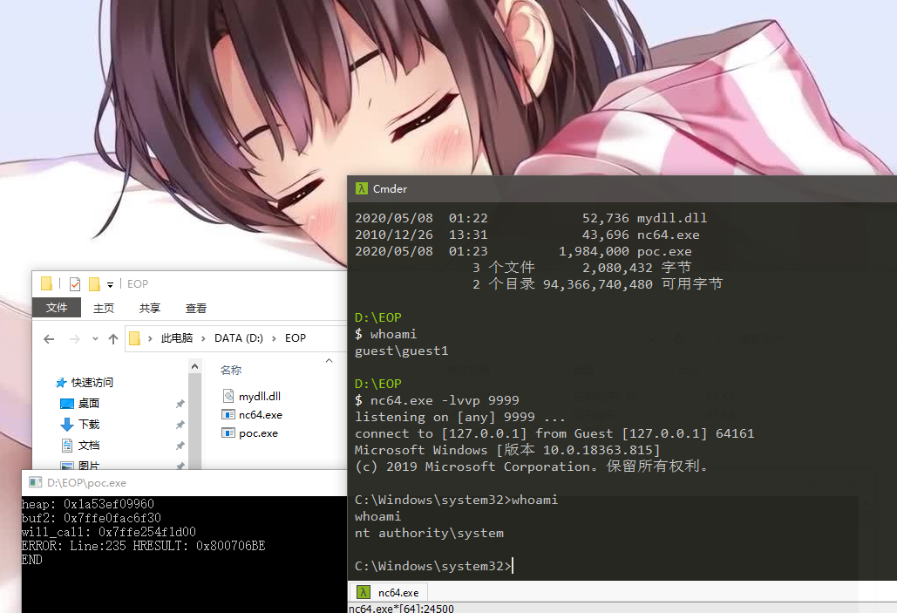

# Exploiting an Elevation of Privilege bug in Windows 10 (CVE-2020-1362) 

## Exploit memory corruption bug - analysis of CVE-2020-1362

`WalletService` has fixed Elevation of Privilege bugs in last Patch Tuesday, one of bugs are assigned with [CVE-2020-1362](https://portal.msrc.microsoft.com/en-us/security-guidance/advisory/CVE-2020-1362). The bug leverage a out-of-bound bug in the service. Here we share our techniques to exploit it.

### Root Cause Analysis

We conducted binary analysis of the following functions in `walletservice.dll`:

- Wallet::WalletCustomProperty::SetGroup


The SetGroup function wrote a user-controlled data in the memory of user-controlled offset. 

```c++
signed __int64 __fastcall Wallet::WalletCustomProperty::SetGroup(__int64 this, int a2, int a3, int a4)
{
  signed __int64 result; // rax

  result = 0i64;
  if ( a2 == 1 )
  {
    if ( a3 & 0xFFFFFFDF )
      return 0x80070057i64;
  }
  else if ( a3 == 0x20 )
  {
    return 0x80070057i64;
  }
  if ( a4 == -1 )
  {
    *(_DWORD *)(this + 8i64 * a2 + 0x74) = 0;
    *(_DWORD *)(this + 8i64 * a2 + 0x78) = 0x7FFFFFFF;
  }
  else
  {
    *(_DWORD *)(this + 8i64 * a2 + 0x74) = a3;
    *(_DWORD *)(this + 8i64 * a2 + 0x78) = a4;
  }
  return result;
}
```

We can notice that the function do not check the range of the offset that the user can control. So this is where the vulnerability occurs.

### From out of bounds memory write to WWW (write-what-where)

We can now write memory out of bounds. By observing we can find that there is a function to set and get BSTR in the same class:

- Wallet::WalletCustomProperty::SetLabel
- Wallet::WalletCustomProperty::GetLabel

So we can easily modify the pointer to BSTR through oobw to obtain the ability to read and write any address. 

### From WWW to arbitrary code execution

Once we have WWW (write-what-where), we can write vtable of Wallet::WalletCustomProperty objects on the heap to control RIP. At the beginning, we tried to modify it directly with oobw, but we found that oobw was not aligned with 8 bytes. So we have to write twice to achive vtable hijack using race condition. But this may make the exploit unstable. There are some other method to get around this. But in our POC we just use another info leak vulnerability ([CVE-2020-1361](https://portal.msrc.microsoft.com/en-us/security-guidance/advisory/CVE-2020-1361)) to leak the heap address and used www to write the vtable directly. BTW, although CVE-2020-1361 is marked as an info leak vulnerability, it actually can be used to achieve EOP. We will make a writeup for it in future.

We found the ```ATL::CComObject<CDXGIAdapter>::`vector deleting destructor``` function in `dxgi.dll` to help us from executing arbitrary functions to arbitrary code execution. This function calls the `loadlibraryEx` function and takes a global pointer as the first parameter of `loadlibraryEx`. Then we can achieve arbitrary code execution by loading a custom dll.

An example POC is provided in `POC` directory.

## Vulnerability Impacts

Through the vulnerability, we can achieve privilege elevation from medium to `NT AUTHORITY\system`. 

Test in Windows 10.0.18363.815, x64



## Credits

Haoran Qin

Zhiniang Peng (@edwardzpeng) of Qihoo 360

## Time Line

**Apr 10 2020:** Vulnerabilities reported

**Apr 21 2020:** MSRC investigated and confirm the bug

**Jul 14 2020:** Patch released

**Jul 17 2020:** Writeup published

