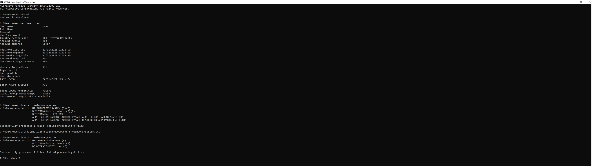

# InstallerFileTakeOver

For your notes, this works in every supporting windows installation. Including Windows 11 & Server 2022 with (November 2021 patch.)

As some of you may notice, this also works in server installations. While Group Policy by default doesn't allow standard users to do any msi operation, the administrative install feature seems to be completely bypassing group policy.

This variant was discovered during the analysis of CVE-2021-41379 patch. the bug was not fixed correctly, however, instead of dropping the bypass. I have chosen to actually drop this variant as it is more powerful than the original one.

I've also made sure that the proof of concept is extremely reliable and doesn't require anything, it works in every attempt. This proof of concept overwrites Microsoft Edge elevation service "DACL" and copies itself to the service location, then executes it to gain elevated privileges. While this technique may not work on every installation, because windows installations such as Server 2016 & 2019 may not have the elevation service. That's why I deliberately left the code, to take over files, so any file specified asme the first argument will be taken over, with the condition that the SYSTEM account must have access to it, and the file must not be in use. So you can elevate privileges yourself.

The best workaround available at the time of writing this, is to wait for Microsoft to release a security patch. Due to the complexity of this vulnerability, any attempt to patch the binary directly will break Windows Installer. So you'd better wait and see how/if Microsoft will screw the patch up again.

Final note, while I was working on the CVE-2021-41379 patch bypass. I was successfuly able to produce 2 msi packages, each of them trigger a unique behaviour in Windows Installer Service. One of them is the bypass of CVE-2021-41379 and this one. I've decided to not release the second version until Microsoft patches this one. So be ready!
